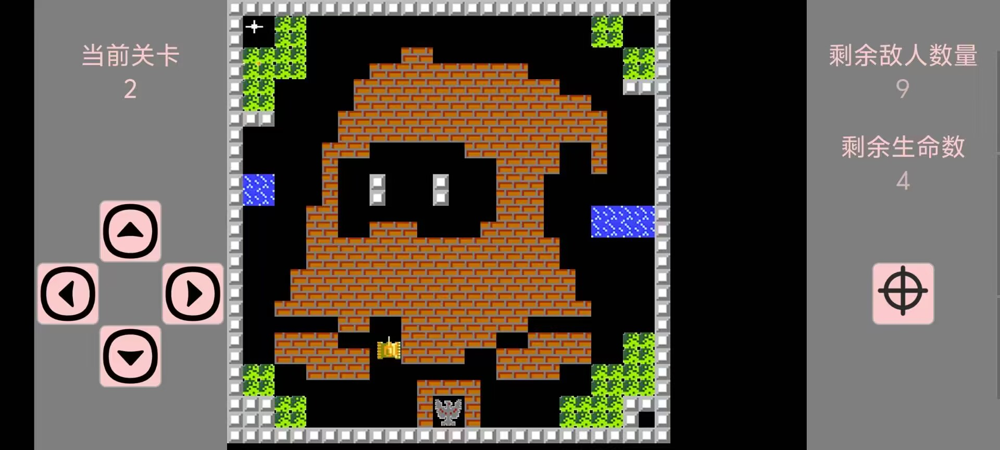
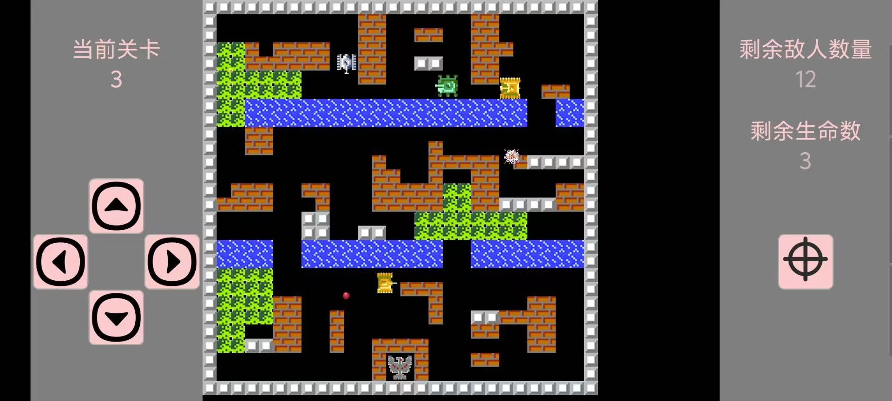

# 坦克大战项目
## 项目介绍
基于android平台的坦克大战游戏，使用Java语言开发，未参考其余开源项目，游戏开发仅由一人完成，素材来自网络。

游戏界面采用自定义surfaceView实现，单线程处理游戏逻辑。大量使用单例模式及工厂模式，代码结构清晰，可读性强，可拓展性强，适合学习Java语言及Android开发 。
## 项目特点
- **游戏逻辑:** 游戏逻辑采用单线程处理，除玩家攻击外，每一帧检测所有的事件并进行更新，如：子弹移动、子弹击中检测、敌人ai、玩家和敌人死亡，游戏结束等。
- **项目结构:** 完整的继承关系，从游戏物件派生出来地图元素和移动物件，再从移动物件派生出子弹、坦克，最后再从坦克派生出玩家和敌人。
- **声音管理:** 采用SoundPool播放音效，并使用静态方法控制播放。
- **动画管理:** 游戏运行时检测存在的动画，并播放动画，对象(子弹等)使用静态方法添加动画。
- **地图创建:** 采用工厂模式，创建地图。
- **玩家交互:** 采用自定义ImageButton实现玩家交互，包括移动、射击，并带有震动反馈等。

## 功能特点
1. 坦克大战游戏，仅支持单人模式，两个界面：主界面和游戏界面。
2. 每辆坦克同时只能存在一个子弹。
3. 子弹打击砖块根据位置可打破一个或者两个砖块。
4. 包含三种敌人，AI各不相同，参数可调节(速度、血量、发射子弹概率及判定间隔、移动成功转向概率及判定间隔、移动失败转向概率及判定间隔)。
5. 敌人生成规则：有敌人和无敌人生成间隔不同，每关最大敌人数不同。
6. 三个关卡，拓展性强，直接增改少量代码即可。

## 待完善功能
1. 增加双人模式。(手机操作下不方便，暂时不考虑)
2. 更复杂的敌人ai。
3. 增加更多的关卡(纯复制粘贴，懒得写了)。
4. 增加更多的音效、动画。
5. **特殊游戏道具**：如暂时无敌，增加移动速度，秒杀敌人等。
## 游戏截图

## 使用方式
运行apk查看release发行版本。代码调试自行导入Android Studio运行。

